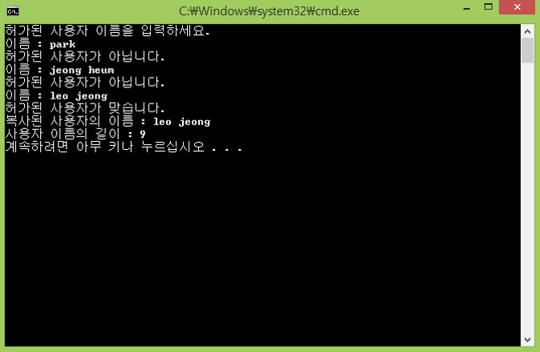

## Week_1
>Standard I/O

## 조건
- 영문 이름 20글자까지 입력 받을 수 있는 문자 배열을 사용
- 문자열을 복사 받는 배열은 입력 받는 배열과 동일한 크기를 사용
- 허가된 사용자의 이름은 “leo jeong” 이고 입력될 때까지 무한 반복을 수행
- 허가된 사용자가 맞을 경우 입력받는 배열이 아닌 복사된 배열로 출력하고, 문자의 길이를 출력
- 허가된 사용자가 아닐 경우 다시 입력하라는 메시지와 함께 반복
- 문자열을 다루는 것은 C언어 스타일의 strcpy, strlen, strcmp를 사용

## 결과 예시

