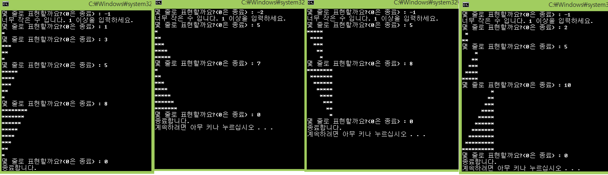
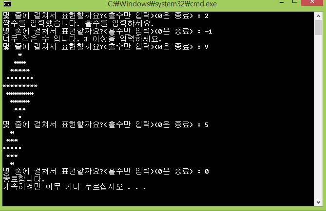
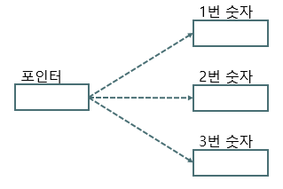
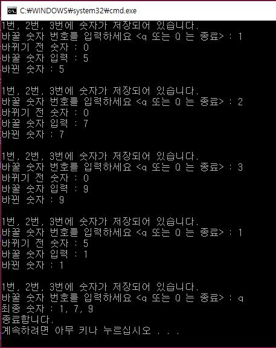

## Day02
**Array & Pointer**

## Quiz_1 조건

- 몇 줄로 표현할 것인지 입력을 받아 모양을 표현

- 무한 반복을 수행하며, 0번이 입력되면 종료

- 결과 예시에 맞춰 총 4개의 프로그램을 구성

## 결과 예시

## Quiz_2 조건

- 몇 줄로 표현할 것인지 입력을 받아 모양을 표현

- 무한 반복을 수행하며, 0번이 입력되면 종료

- 퀴즈 1번에 대한 심화로, 별로 다이아모양 표현

## 결과 예시

## Quiz_3 조건

- 숫자를 저장하고 있는 변수 3개를 생성

- 포인터만을 사용해서 각 숫자 변수에 접근해서 숫자를 변경 및 출력

- 무한 반복으로 수행되며, Q 또는 q 문자가 입력되면 종료

## 결과 예시

