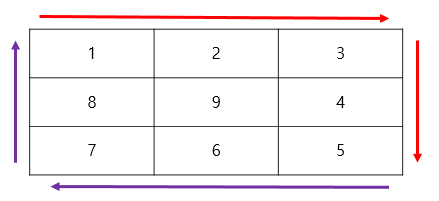
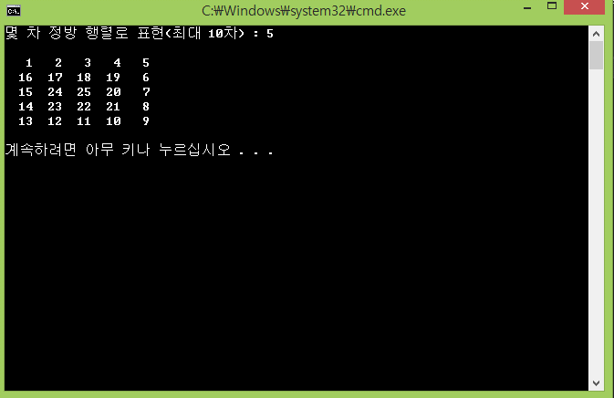
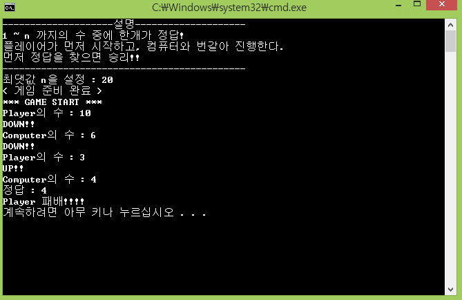
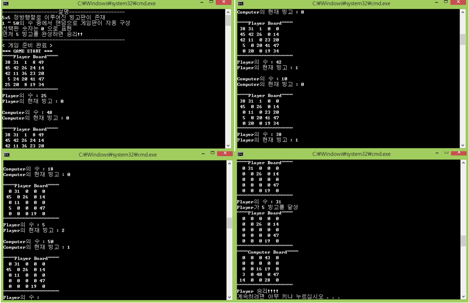

## Day03

**Pointer/Reference & Random**

## Quiz_1 조건

- 정수형 10X10 2차원 배열을 생성

- 몇 차 정방 행렬로 표현할 것인지 입력(최대 10차)

- 아래의 그림과 같이 밖에서 안으로 돌아가면서 숫자를 입력하는 행렬을 구현한다.

## 결과 예시

## Quiz_2 조건

- 컴퓨터와 플레이어 간의 1:1 대전 형식으로 구현한다.

- 플레이어로부터 최댓값 N을 입력 받아 1~N 까지 UP/DOWN 게임이 진행된다.

- 정답은 1~N 중에 랜덤한 값이 지정되고, 플레이어 턴에서 수를 입력하면 UP/DOWN 인지 알려준다.

- 컴퓨터는 자동으로 수를 뽑고, UP/DOWN 인지 알려준다.

## 결과 예시

## Quiz_3 조건

- 컴퓨터와 플레이어 간의 1:1 대전 형식으로 구현한다.

- 플레이어의 게임판은 화면에 출력하고, 컴퓨터의 게임판은 출력하지 않는다.

- 5X5 배열에 1~50 까지의 수를 중복없이 랜덤하게 나열해서 저장한다.

- 선택된 숫자는 '0'으로 표기된다.

- 각 턴에서 수가 선택이 될 때 마다, 플레이어와 컴퓨터의 현재 완성된 빙고의 수와  
현재 플레이어의 게임판을 출력한다.

- 컴퓨터가 수를 선택 할 때는 컴퓨터 게임판에서 선택되지 않은 값들 중에서  
랜덤하게 선택해서 게임이 진행된다.

- 먼저 '5' 빙고를 완성하면 승리한다.

### 결과 예시

