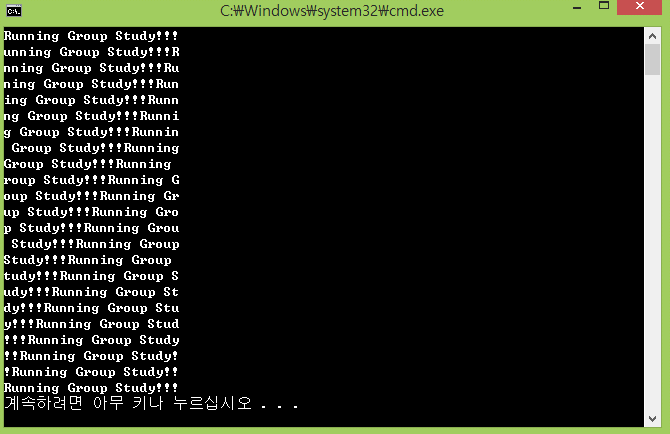
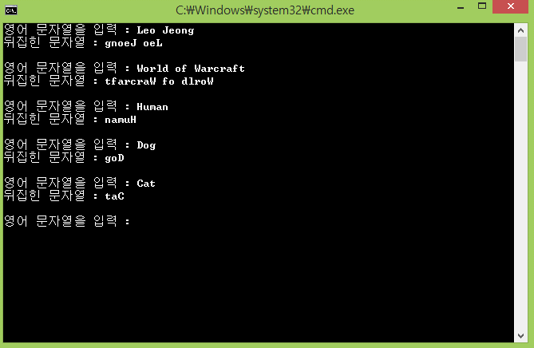

## Day05

**Dynamic Memory & String**

## Quiz_1 조건

- main() 함수와 shiftStr() 함수 2개로 이루어진 프로그램을 구현하자

- char* str = "Running Group Study!!!"; 이라는 C 스타일 문자열이 존재

- 주어진 문자열 str의 크기는 22

- 주어진 문자열이 왼쪽으로 한칸씩 이동하면서, 
최초 첫번째 문자인 R이 다시 돌아오면 프로그램이 종료된다.

## 결과 예시

## Quiz_2 조건

- main() 함수와 reverseStr() 함수 2개로 이루어진 프로그램을 구현하자

- 메인 함수에서 string str = ""; 이라는 C++ 스타일 문자열 변수를 선언

- 사용자로부터 영어 문자열을 입력 받고, 입력 받은 문자열을 뒤집어서 출력

- 주어진 str 변수만을 가지고 무한 반복을 수행

- reverseStr() 함수에서 C++ 스타일 문자열을 C 스타일 문자열로 변환해서 뒤집고, 
C++ 스타일 문자열로 다시 변환해서 반환한다.

## 결과 예시

