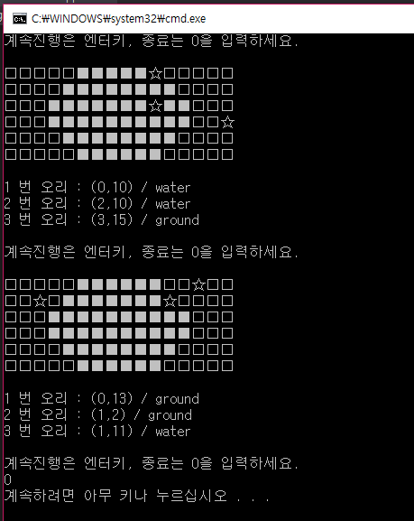

## Day07
**OOP & Class Component**

## Quiz_1 조건

- 소양호 프로그램 
정해진 모양의 소양호에 오리 3마리의 위치가 랜덤으로 나오고 
오리의 위치가 육지인지 호수인지 출력하는 프로그램

- 육지는 '□', 호수는 '■', 오리는 '☆'로 표현한다.

- ManagementDuck 이라는 이름의 클래스를 이용하여 프로그램을 구성

- 멤버 변수로는 오리의 위치를 저장할 위치 변수 예) xpos, ypos 와  
소양호의 모양을 저장할 호수 배열  ex) lake[6][16]  
그 외에 원하는 멤버 변수를 선언하여 사용

- 멤버 변수는 멤버 함수로만 접근할 수 있도록 캡슐화를 지킬 것

- 소양호의 모양은 for문을 사용하여 입력할 것

- 오리 위치는 중복되지 않아야 한다

- 엔터키를 누르면 오리 위치가 랜덤으로 바뀌고, 0을 입력하면 프로그램 종료

## 결과 예시

