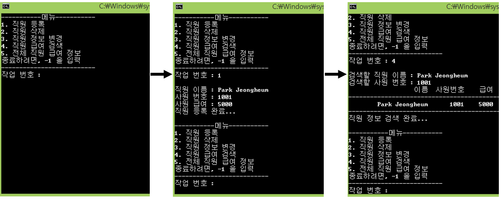
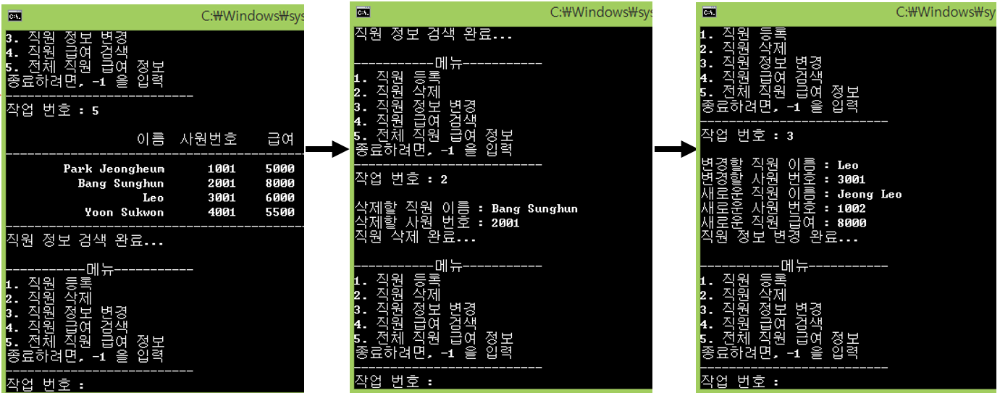
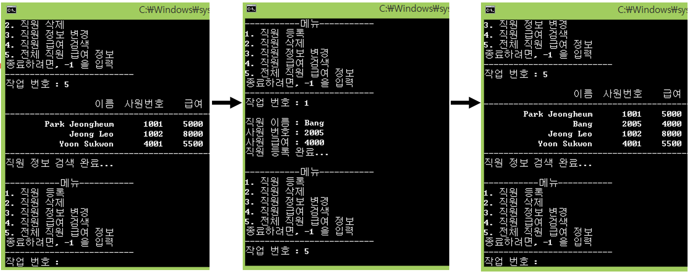

## Day08

**Class Component & Inheritance & Polymorphism**

## Quiz_1 조건

- Employee 클래스를 구현
    - 직원 이름, 사원 번호, 급여를 멤버 변수로 포함
    - 멤버 변수로 이름의 최대 길이 20이 저장
    - 캡슐화를 완성하고, Employee.h 와 Employee.cpp 그리고 main.cpp 세 개를 구현
- 최대 10명까지 저장할 수 있는 객체 포인터 배열을 사용
- 직원 추가, 직원 삭제, 직원 정보 변경, 특정 직원 검색, 전체 직원 검색 기능을 구현
- 이름과 객체들은 동적 할당 받으며, 메모리 해제가 완벽히 구현되야함
- 따라서, Rule of Three 가 완전히 충족되게 구현  
- Rule of Three 란? -> [Rule of Three](http://en.cppreference.com/w/cpp/language/rule_of_three)

## 결과 예시

## Tip

- 신광식 : Rule of three -> C++ 은 다양한 상황에서 사용자 정의 유형의 객체를 복사하고 복사하므로 오류를 예방하기 위해 구현해야 한다.

## 추가할 내용

- 신광식
    - ~~Rule of Three 를 충족시킬 것~~
    - ~~사용자 정의 소멸자, 사용자 정의 복사 생성자, 사용자 정의 사본 할당 연산자 구현~~
