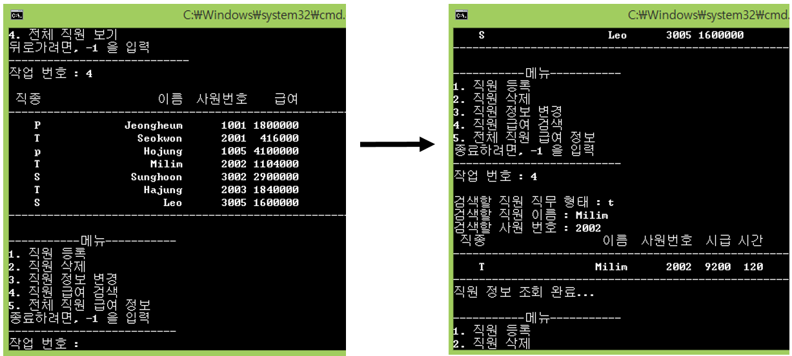

## Day09

**Class Component & Inheritance & Polymorphism**

## Quiz_1 조건

- Employee 클래스를 상속 받는 Permanent 클래스와 Temporary 클래스를 구현 
  Permanent클래스를 상속받는 Sales 클래스 구현
    - 한 명의 직원은 자신의 직무 형태, 이름, 사원번호, 급여 정보를 가진다.
    - 정규직은 월급만, 임시직은 시급과 근무 시간, 판매직은 월급과 판매금 정보를 가진다.
    - 멤버 변수 이름의 최대 길이는 20
    - 캡슐화, 상속, 다형성 모두 사용한다.
    - 각각 헤더파일과 구현파일을 구분한다.
- 직원 추가, 직원 삭제, 직원 정보 변경, 특정 직원 검색, 전체 직원 검색 기능을 구현
    - 전체 직원 검색시, 전체 직원 뿐만 아니라 정규직, 임시직, 판매직 따로 볼 수 있는 기능을 구현
- 이름과 객체들은 동적 할당 받으며, 메모리 해제가 완벽히 구현되야함.
- Rule of Three 충족
   
- Day08 퀴즈의 경우 객체 포인터 배열을 사용하였고, 최대 인원 수가 정해져있었다.
    - 인원이 10명이 넘어가면 새로운 배열을 만들고, 복사 대입 연산자로 새로운 배열을 생성하여 계속 늘려갈 순 있지만, 메모리 낭비와 비효울적인 작업이 일어난다.
    - 또한, 직원 삭제를 했을 때 그 자리가 비어있고, 새로운 직원을 추가하면 마지막에 추가되는 것이 아니라 그 자리에 추가된다.
- 이런 부분적인 문제를 해결하기 위해, main() 함수에서는 객체 포인터 한 개만을 가지고 사용을 하며, 각 객체들은 Linked List로 연결되도록 구현한다.

## 결과 예시

## Tip

- 신광식 : 

## 추가할 내용

- 신광식
