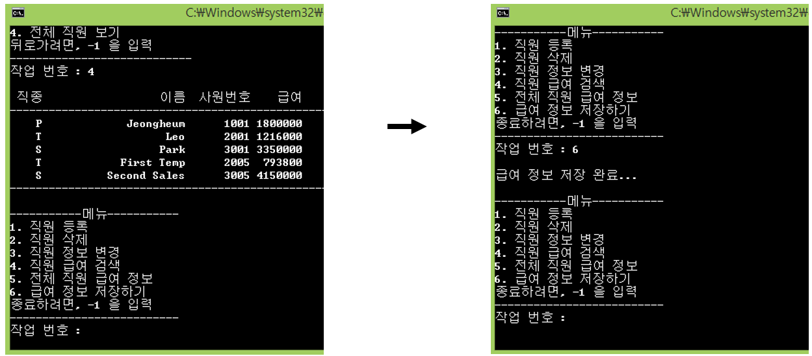
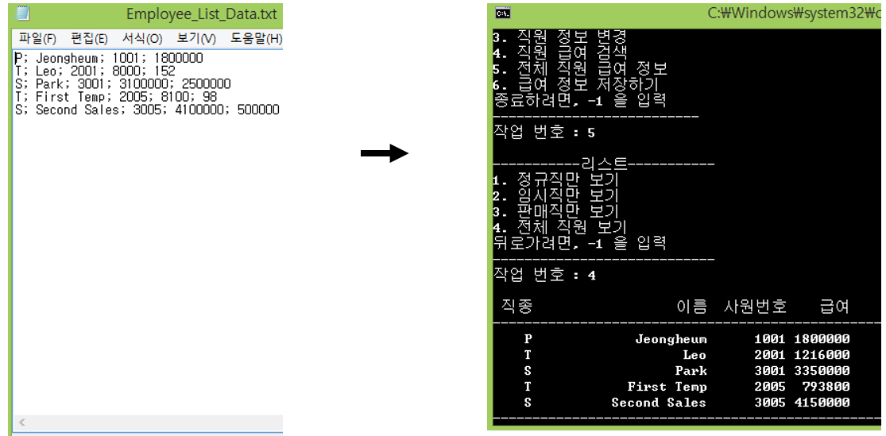

## Day10

**Exception Handling & File I/O**

## Quiz_1 조건

- Day09 의 퀴즈 1번 프로그램을 사용
- 결과화면에 제시된 초기 txt 파일을 읽어들이는 로직을 구현
- 최종적으로 변경된 내용을 txt 파일로 저장하는 로직을 구현
- 메인 메뉴에서 데이터 저장하기 기능을 제공
- Data_File_Read() 함수와 Data_File_Write() 함수를 구현해서 완성

## 결과 예시

## Tip

- 신광식 :

- 박찬종 : ㄱㄱ

## 추가할 내용

- 신광식
