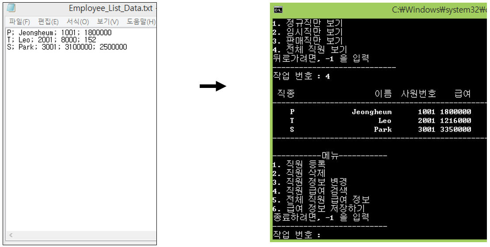

# Day10

**Exception Handling & File I/O**

# Quiz_1 조건

- Day09 의 퀴즈 1번 프로그램을 사용
- 결과화면에 제시된 초기 txt 파일을 읽어들이는 로직을 구현
- 최종적으로 변경된 내용을 txt 파일로 저장하는 로직을 구현
- 메인 메뉴에서 데이터 저장하기 기능을 제공
- Data_File_Read() 함수와 Data_File_Write() 함수를 구현해서 완성

# 결과 예시




# Quiz_2 조건

- Quiz_1 에서 최종으로 만들어진 직원 관리 프로그램을 사용
- 예외 처리를 통해 프로그램이 오류로 인해 종료 되지 않게 변경
- 기본적인 입력 데이터 타입 오류 처리
- 파일 읽고 쓸 때 발생할 수 있는 예외 처리

# 결과 예시


# Tip

- 신광식

  - [Quiz_2] 예외 처리
    - cin 입력 오류 처리
    - cin 오류 플래그를 없애고 입력 스트림을 비우는 것
    ```cpp
    cin >> cmd;
    if(!cin)
    {
      cin.clear();  //clear bad input flag
      cin.ignore(numeric_limits<streamsize>::max(), '\n') //discard input
    }
    ```
    - while 문을 사용하여 알맞은 데이터 타입이 들어올 때 까지 cin 반복
    ```cpp
    while (!(cin >> cmd))
    {
      cin.clear(); //clear bad input flag
      cin.ignore(numeric_limits<streamsize>::max(), '\n'); //discard input
      cout << "Invalid input; please re-enter : ";
    }
    ```


# 추가할 내용

- 신광식
