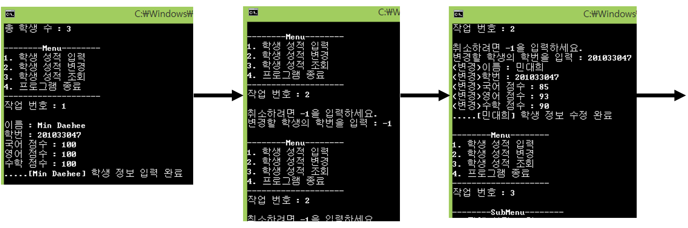

## Week_6
>**Struct & 분할 컴파일**

### Quiz_1 조건
- Day – 04 의 Quiz 2번의 성적 관리 프로그램의 1단계 구체화

- Student 구조체를 정의하는 Student.h 헤더파일을 구현 
name, number, Korean, English, mathematics 멤버 변수를 포함한다. 
name은 20 바이트까지 입력 받을 수 있고, number는 10자리까지 입력 받을 수 있다.

- 최초 총 학생 수를 total 변수에 입력받아서, Student 구조체 변수를 
total 변수의 갯수만큼 포함하는 배열을 동적으로 할당 받는다.

- 성적입력, 성적변경, (성적조회)전체성적, (성적조회)평균성적, 
(성적조회)특정학생조회, 메인메뉴출력, 서브메뉴출력  
7가지 기능을 제공하는 함수를 각각 따로 구현한다.

- 성적입력에서 total 변수보다 많은 학생이 추가될 수 없다.

- 성적변경과 특정학생조회는 학번으로 특정 구조체 변수를 탐색한다.

### 결과 예시

